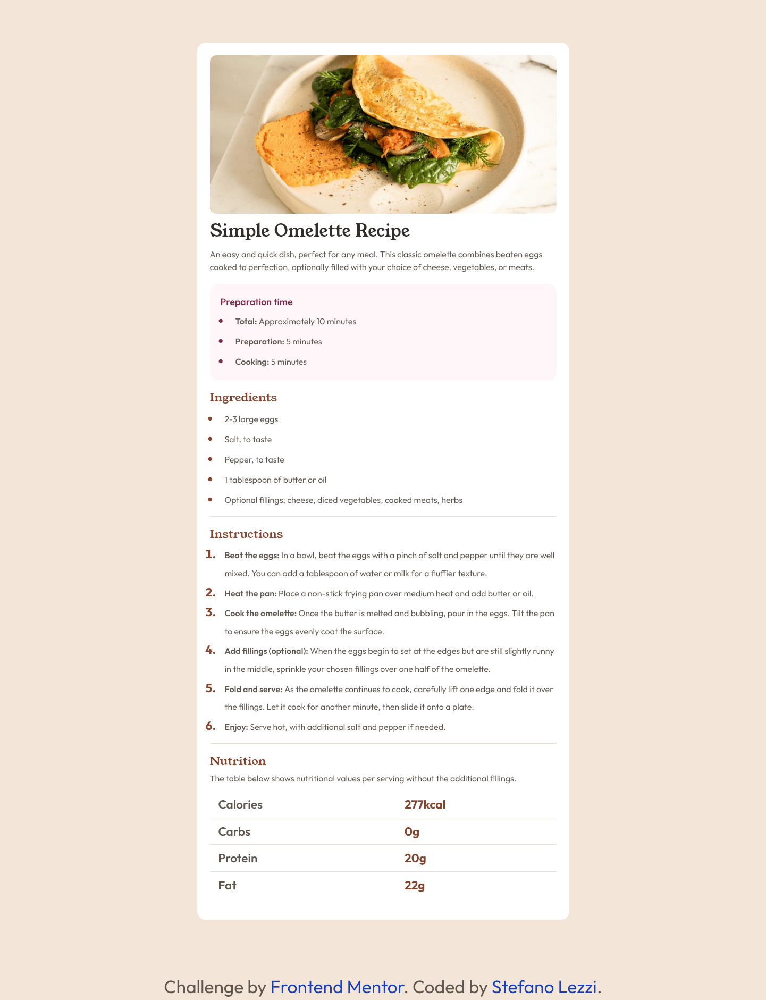
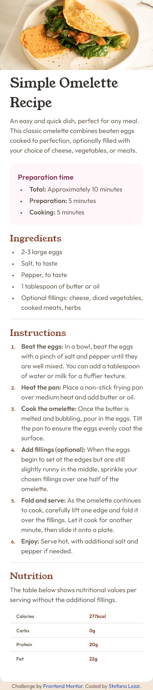

# Frontend Mentor - Recipe page solution

This is a solution to the [Recipe page challenge on Frontend Mentor](https://www.frontendmentor.io/challenges/recipe-page-KiTsR8QQKm). Frontend Mentor challenges help you improve your coding skills by building realistic projects.

## Table of contents

- [Overview](#overview)
  - [Screenshot](#screenshot)
  - [Links](#links)
- [My process](#my-process)
  - [Built with](#built-with)
- [Author](#author)

## Overview

### Screenshot

### Links

- Solution URL: [https://github.com/Steno-95/recipe-page-challenge](https://github.com/Steno-95/recipe-page-challenge)
- Live Site URL: [https://recipe-page-challenge-f-m.netlify.app](https://recipe-page-challenge-f-m.netlify.app)

## My process

### Built with

- Semantic HTML5 markup
- CSS custom properties
- Flexbox
- Tailwindcss
- Desktop-first workflow
- [React](https://reactjs.org/) - JS library

## Author

- Website - [Stefano Lezzi](https://github.com/Steno-95)
- Frontend Mentor - [@Steno-95](https://www.frontendmentor.io/profile/Steno-95)
